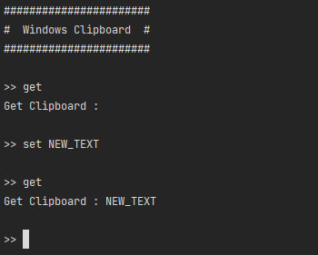

# ItsMyConsole.Tools.Windows.Clipboard
Outil d'accès au presse papier Windows pour le Framework [```ItsMyConsole```](https://github.com/dtarroz/ItsMyConsole)

## Sommaire

- [Pourquoi faire ?](#pourquoi-faire-)
- [Getting Started](#getting-started)
- [Comment se servir de l'outil ?](#comment-se-servir-de-loutil-)
- [Lecture d'un texte dans le presse papier](#lecture-dun-texte-dans-le-presse-papier)
- [Insertion d'un texte dans le presse papier](#insertion-dun-texte-dans-le-presse-papier)

## Pourquoi faire ?

Vous allez pouvoir étendre le Framework pour application Console .Net [```ItsMyConsole```](https://github.com/dtarroz/ItsMyConsole) avec un outil d'accès au presse papier Windows.

L'outil ```ItsMyConsole.Tools.Windows.Clipboard``` met à disposition :
 - La lecture un texte contenu dans le presse papier Windows
 - L'insertion d'un texte dans le presse papier Windows
 - Il permet de ne pas modifier l'état de cloisonnement du thread principal pour accéder au presse papier

## Getting Started

1. Créer un projet **"Application Console .Net"** avec le nom *"MyExampleConsole"*
2. Ajouter [```ItsMyConsole```](https://github.com/dtarroz/ItsMyConsole) au projet depuis le gestionnaire de package NuGet
3. Ajouter ```ItsMyConsole.Tools.Windows.Clipboard``` au projet depuis le gestionnaire de package NuGet
4. Dans le projet, modifier la méthode **"Main"** dans le fichier **"Program.cs"** par le code suivant :
```cs
using ItsMyConsole;
using ItsMyConsole.Tools.Windows.Clipboard;
using System;
using System.Text.RegularExpressions;
using System.Threading.Tasks;

namespace MyExampleConsole
{
    class Program
    {
        static async Task Main() {
            ConsoleCommandLineInterpreter ccli = new ConsoleCommandLineInterpreter();

            // Console configuration
            ccli.Configure(options => {
                options.Prompt = ">> ";
                options.LineBreakBetweenCommands = true;
                options.HeaderText = "#######################\n#  Windows Clipboard  #\n#######################\n";
                options.TrimCommand = true;
            });

            // Display text from clipboard
            ccli.AddCommand("^get$", RegexOptions.IgnoreCase, tools => {
                string text = tools.Clipboard().GetText();
                Console.WriteLine($"Get Clipboard : {text}");
            });

            // Set text in clipboard
            // Example : set NEW_TEXT
            ccli.AddCommand("^set (.+)$", RegexOptions.IgnoreCase, tools => {
                string text = tools.CommandMatch.Groups[1].Value;
                tools.Clipboard().SetText(text);
            });

            await ccli.RunAsync();
        }
    }
}
```

Voici le résultat attendu lors de l'utilisation de la Console :



Dans cet exemple de code on a configuré avec ```Configure```, le prompt d’attente des commandes ```options.Prompt```, la présence d'un saut de ligne entre les saisies ```options.LineBreakBetweenCommands``` et l’en-tête affichée au lancement ```options.HeaderText```. 

Puis avec le premier ```AddCommand```, on a ajouté un pattern d’interprétation des lignes de commande ```^get$``` *(seulement "get")* qui est insensible à la casse ```RegexOptions.IgnoreCase```.

Et avec le deuximème ```AddCommand```, on a ajouté un pattern d’interprétation des lignes de commande ```^set (.+)$``` *(commence par "set" et suivi d'un texte)* qui est insensible à la casse ```RegexOptions.IgnoreCase```.

Lors de l'exécution de la Console, si on saisit une commande qui commence par **"set"** avec le texte à mettre dans le presse papier, il lancera l'implémentation de l'action associée (le deuxième ```AddCommand```). Dans cet exemple, il récupère le texte en utilisant ```tools.CommandMatch``` depuis les outils disponibles *(résultat du Match de l'expression régulière)*. Avec le texte récupéré, il l'insert dans le presse papier Windows en utilisant ```tools.Clipboard().SetText```.

Si on saisit la commande **"get"**, il lancera l'implémentation de l'action associée (le premier ```AddCommand```). Il lit le presse papier en utilisant ```tools.Clipboard().GetText``` et il affiche le texte obtenu.

Maintenant que l'on a configuré la Console et l'implémentation des actions, l'utilisation de ```RunAsync``` lance la mise en attente d'une saisie de commande par l'utilisateur.

## Comment se servir de l'outil ?

Vous pouvez accéder à l'outil d'accès au presse papier Windows lorsque vous ajoutez une interprétation de commande avec ```AddCommand```.

```cs
ConsoleCommandLineInterpreter ccli = new ConsoleCommandLineInterpreter();

// Add command
ccli.AddCommand("<PATERN>", tools => 
{
    string text = tools.Clipboard().GetText();
});
```

Vous devez ajouter ```using ItsMyConsole.Tools.Windows.Clipboard;``` pour avoir accès a l'outil d'accès au presse papier Windows depuis ```tools``` de ```AddCommand```.

## Lecture d'un texte dans le presse papier

Vous pouvez lire un texte contenu dans le presse papiper en utilisant ```GetText```.

```cs
ccli.AddCommand("<PATERN>", tools => 
{
    string text = tools.Clipboard().GetText();
});
```

## Insertion d'un texte dans le presse papier

Vous pouvez insérer un texte dans le presse papier en utilisant ```SetText```.

| Propriété | Description |
| :-------- | :---------- |
| text | Le texte à mettre dans le presse papier |

```cs
ccli.AddCommand("<PATERN>", tools => 
{
    tools.Clipboard().SetText("<TEXT>");
});
```
